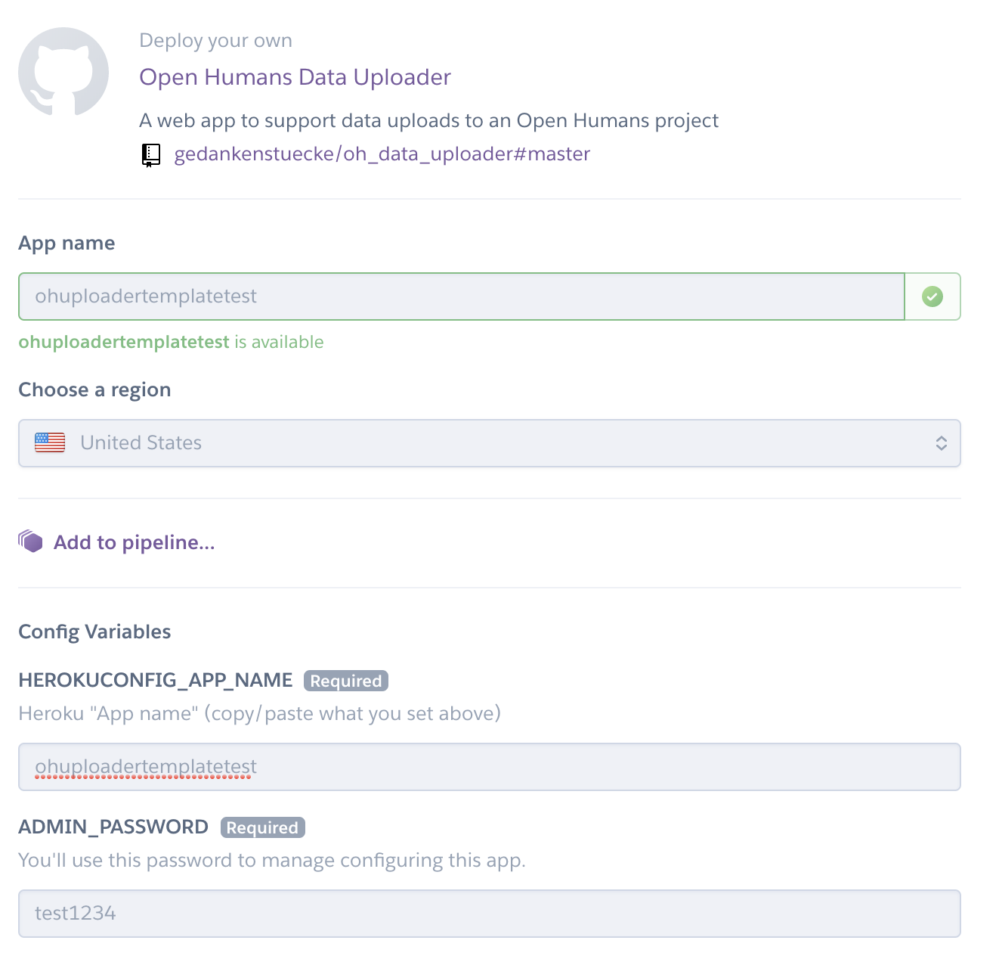
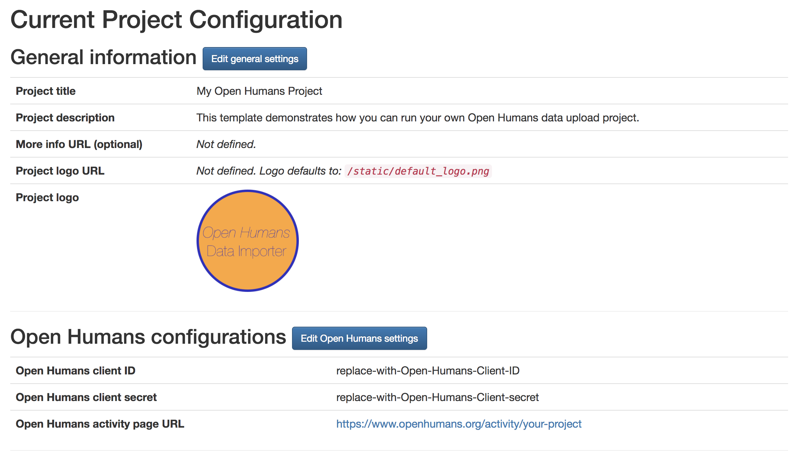

## Deployment to *heroku*.

This is a 5-Step guide to get your own Open Humans data upload project up and running. It does not require neither programming nor command line experience.

### **Step 1**: Click the *deploy to heroku* button above.

Log in into your existing *heroku* account or create a new one. (This Uploader is designed to completely work with the free tier of *heroku*, so you don't have to give them any payment details).

### **Step 2**: Fill out the parameters that *heroku* asks you

(see screenshot below).



*heroku* asks you to give your app a name, for this demo we use `ohuploadertemplatetest`. Repeat this name below for the `HEROKUCONFIG_APP_NAME`. The second important parameter is the `ADMIN_PASSWORD`. You will later need this to connect your uploader to *Open Humans* and to customize your uploader. Once you have entered this information you click on *deploy app* and after a while you should get a success message.

If you have given `ohuploadertemplatetest` as the `HEROKUCONFIG_APP_NAME` your uploader should be available at `https://ohuploadertemplatetest.herokuapp.com/`.

### **Step 3**: Create your project on *Open Humans*

On *Open Humans* you can create a new project by [clicking on *create a new OAuth2 data request project*](https://www.openhumans.org/direct-sharing/projects/manage/).


Fill out the form and enter all the required information. The most important to make sure that your uploader will work is the *Redirect URL*, which will be set depending on your *App name*. If your app's main page is `https://ohuploadertemplatetest.herokuapp.com/`, then the `REDIRECT URL` should be `https://ohuploadertemplatetest.herokuapp.com/complete`.

### **Step 4**: Grab your Oauth credentials from *Open Humans*

Once you click on save in **Step 3** you should come back to the list of all projects you are currently running. This should now contain your new project.


Click on the name of your new project and this new page you will see your `CLIENT ID` and `CLIENT SECRET`. This are the two missing bits of information that you will need to connect your new *heroku* Uploader app to *Open Humans*.


### **Step 5**: Finalize your Uploader setup

You can now go to `https://HEROKUCONFIG_APP_NAME.herokuapp.com/project-admin/login` (replace `HEROKUCONFIG_APP_NAME` with the name you gave in *Step 2*) and use the `ADMIN_PASSWORD` you gave in *Step 2* to log in.



Once logged in you will see a page that gives you all options to edit your template and make it work for your own project. As a most important, first step you should start by clicking `Edit Open Humans settings`. Here you can enter the `CLIENT ID` and `CLIENT SECRET` that you looked up in *Step 4*. Afterwards you can edit more things about your project like:
- the Title & Description
- the metadata used for the uploaded files
- all the texts that should appear on your uploader website.

This last bit is done [by writing Markdown formatted text right into the forms](https://help.github.com/articles/basic-writing-and-formatting-syntax/).

## Local Deployment and Development
The *Open Humans Uploader* is written in *Python 3.6+*, uses the *Django 2.0* framework and is designed to be ultimately deployed
to *Heroku*. You will need some additional modules and packages to locally experiment with this uploader template or to develop it further. A full step-by-step guide that should work for Mac OS (and with minor differences for Linux) [can be found in the INSTALL.md](https://github.com/gedankenstuecke/ftdna-upload/blob/master/INSTALL.md).


## Contributing
We'd love to get your contribution to this project, thanks so much for your interest in this! Please [read our `CONTRIBUTING.md`](https://github.com/gedankenstuecke/ftdna-upload/blob/master/CONTRIBUTING.md) to see how you can help and become part of our team! 🎉 Also have [a look at our `ROADMAP.md`](https://github.com/gedankenstuecke/ftdna-upload/blob/master/ROADMAP.md) to see what we want to work on in the future.


# Local Deployment and Development

This tool is designed to be deployed to *heroku* ([see README.md](https://github.com/gedankenstuecke/ftdna-upload/blob/master/README.md)). To install it
locally to develop it further (or to deploy to non-heroku hosts) see the guidelines here:

### *Step 1: Install pipenv and needed packages*

This project now [uses the recommended `pipenv` workflow for installing dependencies](http://pipenv.readthedocs.io/en/latest/).

If you already have a `Python` installation on your end do the following to get started with all required Python packages do the following from the main `ftdna-upload` folder:

```
pip install pipenv
pipenv install --three
pipenv shell
```

You should now be in a shell that is specifically set up with all the required Python packages. You can exit this shell any time by just writing `exit`. If new packages have been added to this repository any time, you can upgrade all the packages for it by typing `pipenv install` again and it will use the existing `Pipfile` and `Pipfile.lock` to install the appropriate modules.

### *Step 2: Install Heroku Command Line Interface (CLI)*

You should install the Heroku CLI to run this app locally.
Heroku has [installation instructions for MacOS, Windows, and Linux](https://devcenter.heroku.com/articles/heroku-cli#download-and-install).

If you are running MacOS the easiest way to do this is using [Homebrew](https://brew.sh/). After installing Homebrew you have two options:

Simply run:
`brew install heroku/brew/heroku`

Or

```
brew tap heroku/brew
brew install heroku
```

The second option shown above adds the Heroku repository to your Homebrew configuration allowing you to access all of the Heroku library rather than the single `heroku` application.

### *Step 3: Set-up the local `.env` file*
Once this is done you can complete minimal setup by:
* Create an `.env` file from the example: `cp .env.sample .env`
* Edit `.env` to set a random string for `SECRET_KEY` and `ADMIN_PASSWORD`
* Make sure to activate your `Python` environment with `pipenv shell`
* Migrate your database using `heroku local:run python manage.py migrate`
* Initialize config with `heroku local:run python manage.py init_proj_config`

Now you can run the webserver of your local heroku environment using `heroku local`.

This should give you a development server up and running on `http://0.0.0.0:5000`.
On `http://0.0.0.0:5000/project-admin/` you should fine the project admin interface,
you can login to it using the `ADMIN_PASSWORD` you set above.


## FAQ

**When I run `heroku local` or use the app it crashes/complains about missing packages.**

It seems that either new packages are required to run the latest version of `ftdna-upload` or that you're not in the `pipenv shell`. To check for both things run:

```
pipenv install
pipenv shell
heroku local
```
The app should start now.

**I get an error about the project config not found!**

You probably forgot the initialization step. Inside your `pipenv shell` run `heroku local:run python manage.py init_proj_config`

**I get an error about tables/columns not found!**

You probably didn't migrate your database. Run `heroku local:run python manage.py migrate` to add the missing database tables/columns.
